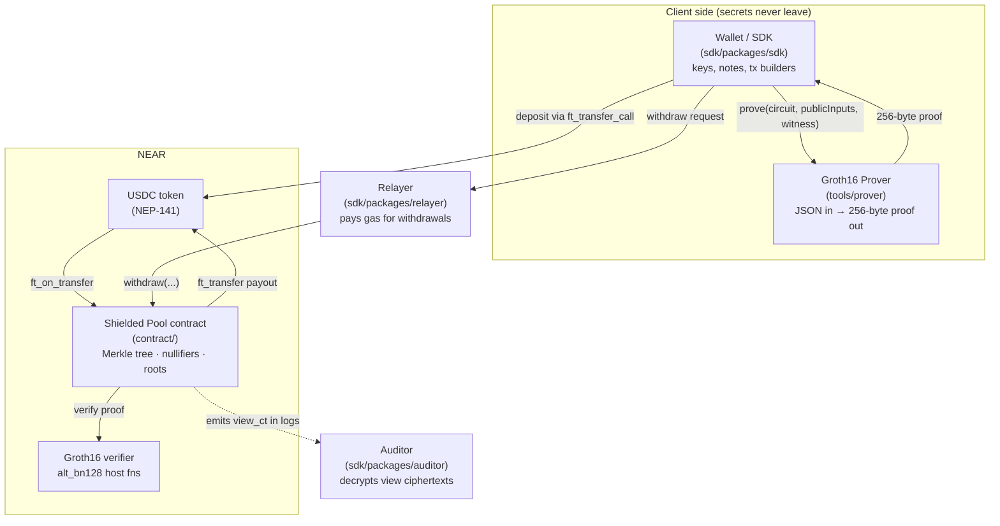
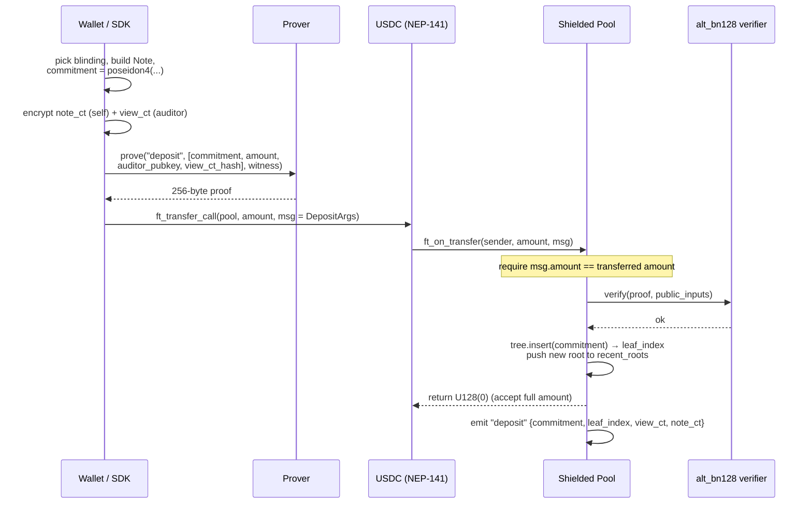
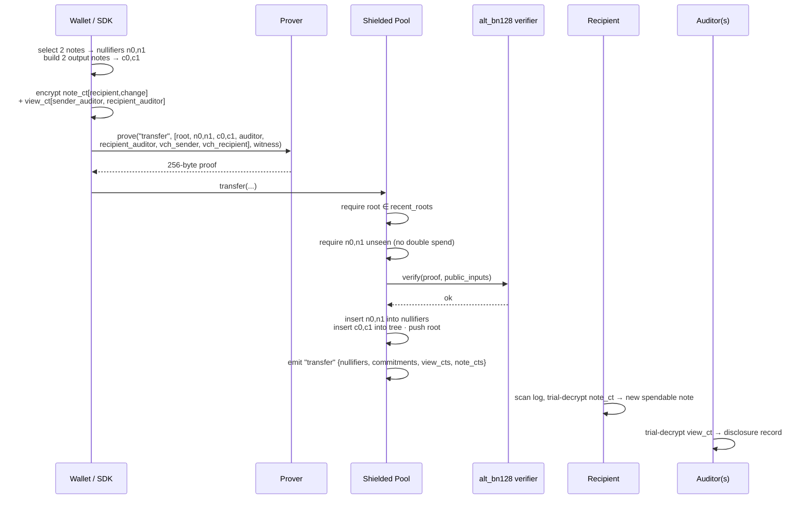

# Shielded USDC Pool — End-to-End Architecture

A study guide to how the privacy-preserving USDC pool works on NEAR, from a user
building a transaction to on-chain verification and auditor disclosure.

> **Scope.** This describes the *real* proving path: arkworks R1CS circuits in
> `tools/prover`, proofs verified on-chain via NEAR's `alt_bn128` host functions
> (`contract/src/groth16.rs`). The Noir circuits under `circuits/` are a
> **reference spec only** — they compile to Honk, which is incompatible with the
> deployed Groth16 verifier. Don't read them as the production proving path.

---

## 1. System overview

Five actors collaborate. Users do all secret work locally (build notes, prove);
the contract only ever sees public inputs and a 256-byte proof.



Key idea: a transaction is *valid* iff a Groth16 proof verifies against a small
set of **public inputs**. Everything secret (note amounts, owner key, blinding,
Merkle paths) stays in the **witness**, which never goes on chain.

---

## 2. Core cryptographic objects

### Note

A note is a private claim on `amount` USDC:

```
Note = { amount, owner_pubkey, auditor_pubkey, blinding }
```

- `owner_pubkey = poseidon2(spending_key, 0)` — deterministic per wallet.
- `auditor_pubkey` — chosen by the user at deposit; binds the note to an auditor.
- `blinding` — fresh random Field per note (hides equal-amount notes).

### Commitment (Merkle leaf)

```
commitment = poseidon4(amount, owner_pubkey, auditor_pubkey, blinding)
```

Inserted as a leaf into an incremental Merkle tree of **depth 20** (~1M notes).

### Nullifier (double-spend tag)

```
nullifier = poseidon2(spending_key, poseidon2(commitment, leaf_index))
```

Published when a note is spent. Only the owner can derive it (needs
`spending_key`), and it's unique per `(commitment, leaf_index)`, so a note can be
spent exactly once. The contract keeps a set of all seen nullifiers.

### The two ciphertexts

Every operation emits ciphertexts in the event log so off-chain parties can
recover what they're entitled to see. Both use X25519 + ChaCha20-Poly1305 sealed
boxes (`sdk/packages/core/src/encrypt.ts`).

| Ciphertext | Encrypted to | Contents | Purpose |
|---|---|---|---|
| `note_ct` | **recipient** viewing key | `{ amount, ownerPubkey, auditorPubkey, blinding }` | Recipient scans the log, trial-decrypts, recovers the note to spend later |
| `view_ct` | **auditor** X25519 key | `ViewDisclosure { action, sender/recipient pubkeys, amounts, memo, timestamp }` | Auditor selective disclosure |

`view_ct` is bound into the proof's public inputs via
`view_ct_hash = hashBytesToField(view_ct)`, so the disclosure can't be swapped
after proving.

### On-chain state (`contract/src/lib.rs`)

- `tree` — incremental Merkle tree (depth 20), O(depth) insert.
- `recent_roots` — rolling window of the last **30** roots, so a proof built
  against a slightly stale root still verifies.
- `nullifiers` — set of spent nullifiers.
- `unclaimed_payouts` — recovery ledger for failed FT transfers (see §4.2).

---

## 3. The proving boundary

The SDK never embeds a prover; it calls an **injected** one
(`sdk/packages/sdk/src/prover.ts`):

```ts
interface Prover {
  prove(req: {
    circuit: "deposit" | "transfer" | "withdraw";
    publicInputs: string[];          // 0x 32-byte big-endian hex
    witness: Record<string, unknown>;
  }): Promise<Uint8Array>;            // 256-byte Groth16 proof
}
```

The reference `SubprocessProver` shells out to the `shielded-prover` binary:
JSON on stdin → 256 raw proof bytes on stdout (`A_g1‖B_g2‖C_g1`). The contract
verifies those bytes against the circuit's verifying key using
`env::alt_bn128_pairing_check`.

**Public input vs. witness** — what the chain checks vs. what stays secret:

| Circuit | Public inputs (on chain) | Witness (secret) |
|---|---|---|
| deposit | `[commitment, amount, auditor_pubkey, view_ct_hash]` (4) | `owner_pubkey`, `blinding`, `view_ct_hash` preimage binding |
| withdraw | `[root, nullifier, recipient, amount, relayer, relayer_fee, auditor_pubkey, view_ct_hash]` (8) | note fields, `spending_key`, `leaf_index`, Merkle path[20] |
| transfer | `[root, n0, n1, c0, c1, auditor, recipient_auditor, view_ct_hash_sender, view_ct_hash_recipient]` (9) | 2 input notes + paths, `spending_key`, 2 output notes |

(`recipient`/`relayer` accounts enter as `hashBytesToField(account)`.)

---

## 4. End-to-end flows

### 4.1 Deposit

A user converts public USDC into a private note. Deposit is driven by the
NEP-141 `ft_transfer_call` pattern: the pool is notified by the **token
contract**, not called directly, so the amount can't be forged.



No nullifier is touched — a deposit only *creates* a note. The depositor's NEAR
account (`sender_id`) is visible to the token contract but is **not** a circuit
input, so it isn't linked to the commitment on chain.

### 4.2 Withdraw

A user converts a private note back into public USDC sent to a NEAR account,
optionally paying a relayer to submit (and front the gas).

```mermaid
sequenceDiagram
    participant W as Wallet / SDK
    participant P as Prover
    participant R as Relayer
    participant Pool as Shielded Pool
    participant V as alt_bn128 verifier
    participant U as USDC (NEP-141)

    W->>W: select note, compute nullifier,<br/>build Merkle path[20]
    W->>P: prove("withdraw", [root, nullifier, recipient,<br/>amount, relayer, fee, auditor, view_ct_hash], witness)
    P-->>W: 256-byte proof
    W->>R: quote() → fee; submit(proof + public fields)
    Note over R: check relayer==me, fee==quote, fee<=amount
    R->>Pool: withdraw(...)
    Pool->>Pool: require_storage_deposit · proof/ciphertext bounds
    Pool->>Pool: require root ∈ recent_roots ("stale root")
    Pool->>Pool: require nullifier unseen ("double spend")
    Pool->>V: verify(proof, public_inputs)
    V-->>Pool: ok
    Pool->>Pool: nullifiers.insert(n) · emit "withdraw"
    Pool->>U: ft_transfer(recipient, amount-fee) .then(callback)
    Pool->>U: ft_transfer(relayer, fee) .then(callback)
    alt ft_transfer fails
        U-->>Pool: failure
        Pool->>Pool: unclaimed_payouts[recipient] += amount<br/>emit "payout_recovered"
        Note over W: later: claim() retries payout
    end
```

The **recovery path** matters: the nullifier is marked spent *before* the
cross-contract `ft_transfer` resolves, so a failed transfer must not lose funds.
The `.then` callback credits `unclaimed_payouts`, and the recipient can call
`claim()` to retry — no relayer, no fee.

### 4.3 Transfer

A private→private payment: spend 2 input notes, create 2 output notes (recipient
+ change). Always 2-in/2-out to keep the structure uniform.



Value conservation (`in0+in1 == out0+out1`) and Merkle inclusion of both inputs
are enforced *inside the circuit* — the contract only checks the public inputs
and nullifier/root bookkeeping.

---

## 5. Privacy & trust model

**Who sees what:**

- **The chain / public:** commitments, nullifiers, roots, the public NEAR
  accounts on withdraw (recipient, relayer) and the cleartext withdraw/deposit
  amounts. It does **not** see which note funded a withdrawal, note ownership, or
  transfer amounts.
- **Recipient:** decrypts `note_ct` addressed to their viewing key to learn the
  note they can spend. Can't decrypt anyone else's.
- **Auditor:** decrypts `view_ct` addressed to their X25519 key — a selective
  disclosure of the transaction. Transfers can address sender and recipient
  disclosures to *different* auditors; no cross-auditor leakage.

**Trust assumptions:**

- **Relayer is untrusted.** `relayer` and `relayer_fee` are public inputs baked
  into the proof, so a relayer can't redirect funds or inflate the fee — it can
  only choose to submit or not.
- **Double-spend & replay:** enforced by the nullifier set; stale proofs are
  bounded by the 30-root window.
- **Soundness rests on the circuits + trusted setup.** This prototype is
  **sandbox only** — see the path-to-mainnet gates in the README (circuit
  soundness review, a real trusted-setup ceremony, external audit).

---

## 6. Deploy note (wasm feature constraint)

Since Rust 1.87 the `wasm32-unknown-unknown` target emits bulk-memory ops
(`memory.copy`/`memory.fill`) from precompiled std, which the NEAR runtime
rejects at deploy time with `PrepareError(Deserialization)`. The deployable
artifact must be produced with:

```sh
wasm-opt --enable-bulk-memory --llvm-memory-copy-fill-lowering -Oz \
  --strip-debug --strip-producers \
  target/wasm32-unknown-unknown/release/shielded_pool.wasm \
  -o target/wasm32-unknown-unknown/release/shielded_pool.opt.wasm
```

`scripts/check-production-readiness.sh` validates that the artifact uses only
NEAR-deployable wasm features, so this regression can't slip through.

---

## File map

| Area | Path |
|---|---|
| Contract entry / state | `contract/src/lib.rs` |
| Operations | `contract/src/{deposit,withdraw,transfer}.rs` |
| Groth16 verifier (alt_bn128) | `contract/src/groth16.rs`, `verifier.rs` |
| Merkle / roots / nullifiers | `contract/src/{merkle,roots,nullifiers}.rs` |
| FT (NEP-141) + payout recovery | `contract/src/ft.rs`, `withdraw.rs` |
| Prover (arkworks R1CS) | `tools/prover/src/` |
| SDK wallet + tx builders | `sdk/packages/sdk/src/wallet.ts` |
| Crypto primitives | `sdk/packages/core/src/` |
| Relayer / Auditor | `sdk/packages/{relayer,auditor}/src/` |
| Reference circuits (Honk, non-production) | `circuits/` |
